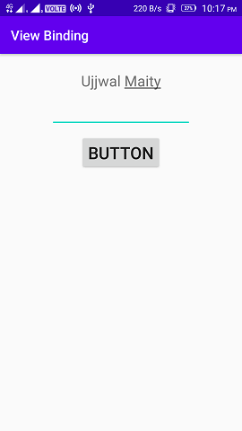

# ViewBinding

- View binding is available in Android Studio 3.6 Canary 11+.

```kotlin
android {

    viewBinding {
        enabled = true
    }
}
```

```kotlin
lateinit var binding: ActivityMainBinding

override fun onCreate(savedInstanceState: Bundle?) {
    super.onCreate(savedInstanceState)
    
    binding = ActivityMainBinding.inflate(layoutInflater)
    setContentView(binding.root)

    binding.button.setOnClickListener {
        binding.textView.text = binding.editText.text
        binding.editText.setText("")
    }
}
```

